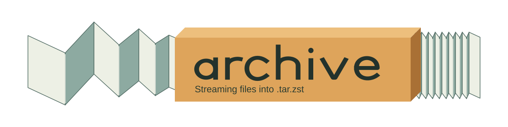

<picture>
  <source media="(prefers-color-scheme: dark)" srcset=".github/banner.svg">
  <source media="(prefers-color-scheme: light)" srcset=".github/banner-light.svg">
  
</picture>

A small streaming archival tool. Remote files are read from the network and written directly through tar and Zstandard into the final archive; model files are never staged uncompressed on disk.

## Usage

```text
archive git https://github.com/coalaura/archive.git
archive git git@github.com:coalaura/archive.git --revision main
archive git /path/to/local/repository -r <commit-or-tag>
archive huggingface Qwen/Qwen3.8-27B
archive huggingface Qwen/Qwen3.8-27B --revision main
archive hf Qwen/Qwen3.8-27B -r <commit-or-tag>
```

The binary reads `config.yml` from the current working directory:

```yaml
tokens:
  huggingface: "hf_..."
```

The config file is optional for public repositories.

Archives are written in the current working directory under:

```text
archive/
  git/
    .partial/
    https___github.com_coalaura_archive.git@<commit>.tar.zst
  huggingface/
    .partial/
    Qwen_Qwen3.8-27B@<commit>.tar.zst
```

Each tracked repository file is placed under `repository/` in the tar archive. `.archive/manifest.json` contains the provider, pinned commit, file metadata and SHA-256 hashes calculated while streaming each file. Git archives preserve executable files and symbolic links, omit `.git` and do not expand submodules.

Git repositories default to `HEAD`; Hugging Face repositories default to `main`. The `git` command requires Git to be installed and uses a temporary bare object store under `archive/git/.partial/` that is removed after the archive attempt. It never checks out a working tree.

## Failure handling

Each tar entry is compressed as an independent concatenated Zstandard frame. If a transfer fails, only the current frame is truncated and retried.

The provider's `.partial/` directory contains unfinished archives and a small state file that checkpoints completed entries. Re-running the same command resumes the pinned commit from the last fully synced file instead of starting the archive from scratch. If a process is interrupted before cleanup, any temporary Git objects also remain contained there.
